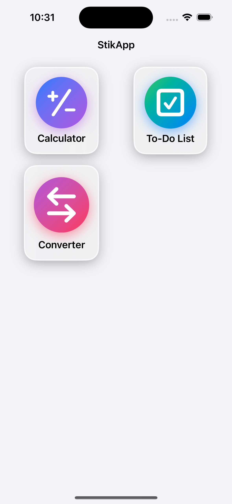
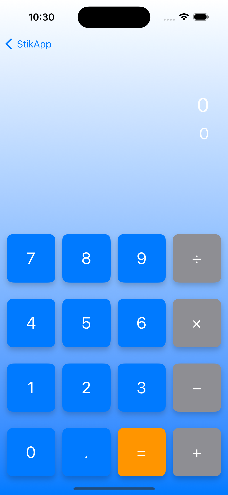
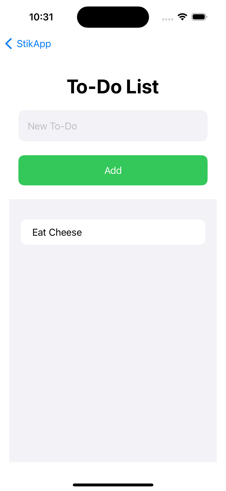
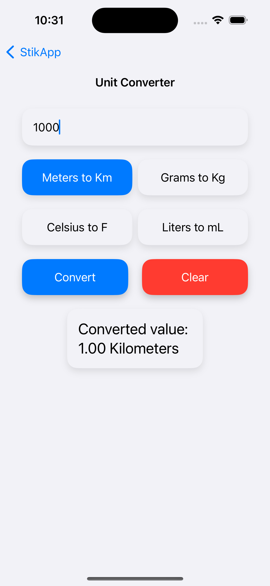

# StikApp App

StikApp App is an iOS application built using SwiftUI, designed to offer multiple tools in one place, including a Calculator, To-Do List, and Unit Converter.

## Features

- **Calculator:** Perform basic arithmetic operations.
- **To-Do List:** Manage your tasks efficiently.
- **Unit Converter:** Convert units of measurement (e.g., meters to kilometers, grams to kilograms).

## Where is the code?

At StikApp we are dedicated to provideing a secure user experiance, so parts of the code will be open sourced. It will only be parts to ensure that the code is not stolen.

## Screenshots

    
    
    
    

